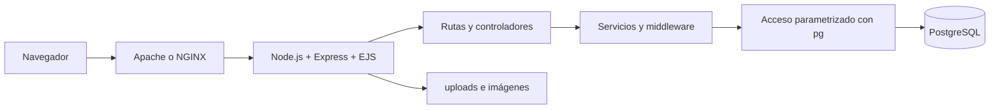

**Materia:** Integración de Aplicaciones Computacionales

**Nombre:** Santiago López Cervantes

**Matrícula:** 612956

**Grupo y hora:** MyV, 4:00 p.m.

**Fecha:** 2026-08-31

## Introducción

Este ejercicio aborda el desarrollo de una aplicación web monolítica para administrar el catálogo de una librería. La solución integra Node.js, Express, EJS y PostgreSQL, y se despliega en una instancia de Compute Engine mediante GCP SDK CLI. El trabajo requiere justificar las decisiones de arquitectura, modelar los datos hasta 4FN, implementar autenticación, CRUD, imágenes y conceptos asociados a libros, y publicar evidencias reproducibles.

## Objetivo

Diseñar, construir, probar, desplegar y documentar una aplicación web monolítica server-side para la gestión de una librería, utilizando acceso directo y seguro a PostgreSQL desde Node.js.

## Alcance y restricciones

La aplicación permitirá administrar usuarios, libros, autores, géneros, formatos, categorías, imágenes y conceptos. Utilizará Node.js, Express y EJS en una sola unidad desplegable, con consultas SQL parametrizadas mediante `pg`. No se desarrollarán APIs REST, GraphQL, SOAP ni microservicios, y Node.js escuchará únicamente en `127.0.0.1:3000` detrás de Apache o NGINX.

## Parte 1: Análisis del problema

### Requisitos funcionales

Los siguientes requisitos son los requisitos funcionales detectados para la aplicación a desarrollar:

* **RF1**: Registro, inicio y cierre de sesión.
* **RF2**: Consulta y búsqueda del catálogo por ISBN y título.
* **RF3**: CRUD de libros, autores, géneros, formatos, categorías y conceptos.
* **RF4**: Relaciones múltiples entre libros y autores, géneros y conceptos.
* **RF5**: Carga, edición, eliminación y selección de portada para imágenes.
* **RF6**: Control de precio y stock.
* **RF7**: Administración exclusiva para un único usuario Administrador.

### Actores y riesgos

Se definen los siguientes actores como los principales usuarios de la página a desarrollar:

| **Actor** | **Puede realizar**| **Debe rechazarse** |
| :--- | :--- | :--- |
| Visitante | Registro e inicio de sesión | Catálogo privado y administración |
| Usuario registrado | Consultar libros y conceptos permitidos | CRUD y funciones administrativas |
| Administrador | CRUD y administración completa | Crear un segundo Administrador |

Los riesgos principales son acceso no autorizado, SQL Injection, archivos peligrosos, exposición de credenciales, eliminación accidental y publicación de datos sensibles.

## Parte 2: Arquitectura y organización

La solución sigue siendo monolítica porque presentación, rutas, lógica, middleware y acceso a datos se despliegan como una sola aplicación, aunque el código esté separado en módulos. `app.js` inicializa Express; `config/` gestiona la conexión; `routes/` coordina solicitudes; `services/` concentra reglas; `middleware/` aplica autenticación, autorización y errores; `views/` contiene plantillas EJS; `public/` contiene recursos estáticos y `uploads/` administra archivos.

## Parte 3: Diseño de datos y 4FN

El modelo separa `books`, `authors`, `genres`, `formats`, `categories`, `concepts` e `images`, además de tablas puente para relaciones multivaluadas como libro-autor, libro-género y libro-concepto. La normalización parte de una estructura con listas repetidas, avanza por 1FN, 2FN y 3FN/BCNF, y llega a 4FN separando cada dependencia multivaluada independiente. Las claves primarias, foráneas, `UNIQUE`, `CHECK`, índices y la restricción de Administrador único deben implementarse en PostgreSQL.

## Parte 4: Implementación y seguridad

La aplicación debe usar variables de entorno para secretos, hash seguro para contraseñas, consultas parametrizadas, validación server-side, autorización por rol, sesiones protegidas y mensajes de error controlados. Las imágenes deben aceptar únicamente JPG, PNG y WebP, validar MIME y tamaño, generar nombres seguros y almacenar metadatos sin exponer rutas internas.

## Parte 5: Infraestructura y despliegue

Se documentará la creación de Compute Engine con GCP SDK CLI, la instalación de CentOS Stream 10 y PostgreSQL, la carga ordenada de scripts SQL y la configuración del reverse proxy. Node.js deberá probarse localmente en `http://127.0.0.1:3000/library` y publicarse mediante `http://IP_DEL_SERVIDOR/library`.

## Evidencias

Agrega `REQUIREMENTS.md`, `ENGINEERING_DECISIONS.md`, diagramas, scripts SQL, plan de pruebas, revisión de seguridad, capturas de PostgreSQL, autenticación, CRUD, uploads y acceso final mediante Apache o NGINX. No publiques `.env`, claves, tokens, contraseñas ni `node_modules`.

## Conclusión

El ejercicio integra análisis, diseño de datos, programación web, seguridad, despliegue y documentación en una solución monolítica coherente. El enfoque es adecuado para un equipo pequeño y un sistema académico porque reduce la complejidad operativa, aunque concentra el escalamiento y el despliegue en una sola unidad. La calidad de la solución dependerá de demostrar la normalización hasta 4FN, proteger las operaciones administrativas, validar entradas y conservar evidencias reproducibles de cada prueba.

## Referencias consultadas

1. Express.js. *Express web framework*. https://expressjs.com/
2. Node.js. *Documentation*. https://nodejs.org/docs/latest/api/
3. PostgreSQL Global Development Group. *PostgreSQL Documentation*. https://www.postgresql.org/docs/
4. Google Cloud. *Compute Engine documentation*. https://cloud.google.com/compute/docs
5. OWASP Foundation. *OWASP Top 10*. https://owasp.org/www-project-top-ten/