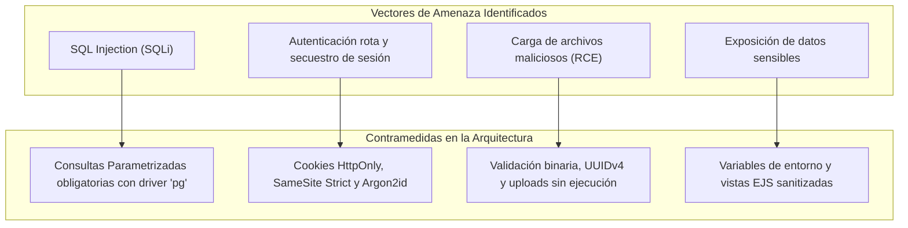
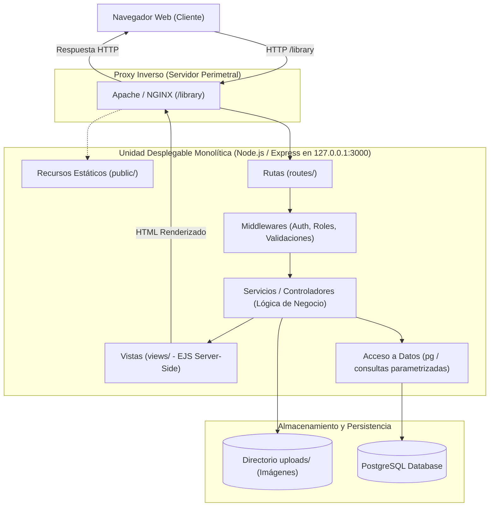
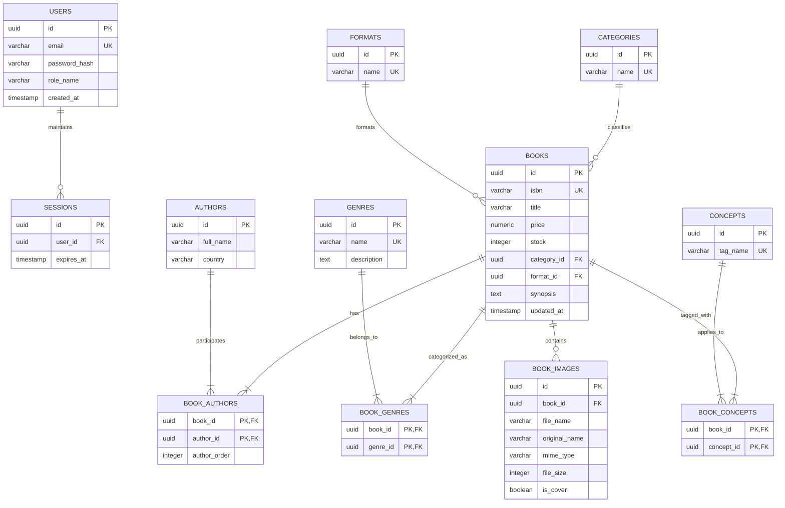

**Materia:** Integración de Aplicaciones Computacionales

**Nombre:** Santiago López Cervantes

**Matrícula:** 612956

**Grupo y hora:** MyV, 4:00 p.m.

**Fecha:** 2026-08-31

## Introducción

Este ejercicio aborda el desarrollo exhaustivo de una aplicación web monolítica orientada a la gestión integral y persistencia del catálogo de una librería profesional. La arquitectura desacopla responsabilidades internas mediante capas lógicas cohesivas (presentación con renderizado en servidor, orquestación de rutas, middleware de seguridad, servicios de negocio y acceso a datos parametrizado), manteniendo al mismo tiempo una única unidad de empaquetado y despliegue.

La pila tecnológica se fundamenta en **Node.js**, **Express**, **EJS** y **PostgreSQL**, ejecutándose sobre una máquina virtual con **CentOS Stream 10** en **Google Cloud Platform (GCP Compute Engine)** aprovisionada vía **GCP SDK CLI**. La solución implementa autenticación basada en sesiones seguras, control de acceso basado en roles (RBAC), control granular de concurrencia y transacciones ACID para relaciones complejas, así como un proceso formal de normalización relacional hasta la **Cuarta Forma Normal (4FN)**.

---

## Objetivo

Diseñar, construir, probar, desplegar y documentar una aplicación web monolítica *server-side* de alto rendimiento y seguridad para la administración de un catálogo editorial, garantizando la integridad referencial en PostgreSQL, el aislamiento de red mediante proxy inverso (Apache/NGINX) y la mitigación rigurosa de vulnerabilidades del catálogo OWASP Top 10.

---

## Alcance y restricciones

### Alcance
* Administración integral del ciclo de vida del catálogo editorial: libros, autores, géneros literarios, formatos físicos/digitales, categorías y conceptos temáticos.
* Gestión de recursos multimedia (imágenes de portada y muestras), con validación de cabeceras binarias (MIME), sanitización de metadatos y renombrado criptográfico.
* Sistema de autenticación con hashing resistente (`bcrypt`/`argon2`) y control estricto de roles (*Visitante*, *Usuario registrado*, *Administrador*).
* Despliegue automatizado en infraestructura cloud con balanceo de carga/proxy inverso y aislamiento del proceso Node.js en interfaz *loopback*.

### Restricciones técnicas y de diseño
1. **Unidad monolítica estricta**: No se permite la fragmentación en microservicios, microfrontends ni el uso de APIs desacopladas de tipo SPA (Single Page Application), REST pura consumida por frontend externo, GraphQL o SOAP.
2. **Conexión directa y parametrizada**: La interacción con PostgreSQL debe realizarse mediante el driver nativo `pg` utilizando *Prepared Statements* o consultas parametrizadas obligatorias. Se prohíbe el uso de ORMs complejos que oculten el esquema o generen sobrecarga no justificada.
3. **Aislamiento de red**: El proceso de Node.js debe escuchar exclusivamente en el puerto `127.0.0.1:3000`. Todo el tráfico entrante de clientes debe ser gestionado y filtrado por un proxy inverso (**Apache HTTP Server** o **NGINX**) en los puertos estándares 80/443 con prefijo de ruta `/library`.
4. **Regla de administrador único**: La base de datos y la capa de servicios deben impedir terminantemente la existencia de más de una cuenta con rol `ADMIN`.

---

## Parte 1: Análisis del problema y modelo de actores

### Requisitos funcionales detallados

* **RF1 - Gestión de Identidad y Sesiones**: Registro de usuarios nuevos (por defecto rol cliente), inicio de sesión con validación de hash criptográfico, manejo de sesiones persistentes en base de datos con expiración y cierre seguro de sesión (*logout* con invalidación de cookie).
* **RF2 - Consulta y Búsqueda Avanzada**: Visualización paginada del catálogo público, filtros dinámicos por género, autor, rango de precios y búsqueda fonética o por subcadena en título e ISBN-13 con índices B-Tree/GIN optimizados.
* **RF3 - Operaciones CRUD Centralizadas**: Creación, consulta, modificación y baja lógica/física de entidades maestras (libros, autores, categorías, formatos y conceptos).
* **RF4 - Manejo de Cardinalidad M:N Compleja**: Asociación atómica y transaccional entre un libro y múltiples autores, múltiples géneros y múltiples etiquetas conceptuales sin redundancia multivaluada.
* **RF5 - Gestión Segura de Archivos (Uploads)**: Carga de portadas con verificación de *magic numbers* (firmas binarias), limitación de tamaño máximo a 2 MB por archivo, almacenamiento en disco bajo nombres UUIDv4 y registro relacional de metadatos.
* **RF6 - Control de Inventario y Precios**: Restricciones de integridad de dominio (`CHECK (stock >= 0)`, `CHECK (price > 0.00)`) con actualización atómica de existencias.
* **RF7 - Control de Acceso y Gestión Administrativa**: Rutas protegidas exclusivas para el usuario Administrador con guardas a nivel de middleware.

### Matriz de actores, permisos y restricciones

Para el sistema de gestión bibliotecario, se han identificado los siguientes actores como aquellos actores involucrados en la operación de la aplicación. Se define en la siguiente tabla que privilegios y operaciones tienen permitidas, con el objetivo de mantener una trazabilidad de las acciones de los actores en la aplicación a desarrollar.

| **Actor** | **Privilegios y Operaciones Permitidas** | **Restricciones y Respuestas Esperadas** |
| :--- | :--- | :--- |
| **Visitante (Anónimo)** | • Exploración del catálogo público general.<br>• Consulta de ficha técnica de libros.<br>• Acceso a formularios de registro e inicio de sesión. | • Denegación de acceso a `/admin/*` y `/user/*` (HTTP 401 / Redirección a Login).<br>• Prohibida la descarga de fichas de auditoría. |
| **Usuario Registrado** | • Acceso a perfil personal.<br>• Consulta de conceptos y notas adicionales del catálogo.<br>• Cambio de contraseña propia. | • Prohibida cualquier mutación del catálogo (POST/PUT/DELETE sobre libros, autores o catálogos).<br>• Intento de escalada a `/admin/*` devuelve HTTP 403 Forbidden. |
| **Administrador Único** | • Control total CRUD sobre libros, autores, géneros, formatos, categorías, conceptos e imágenes.<br>• Panel de control de stock y auditoría de sesiones. | • **Invariable**: No puede crear ni promover a un segundo usuario con rol `ADMIN`.<br>• No puede eliminar su propia cuenta si deja al sistema sin administrador activo. |

### Matriz de riesgos de seguridad y mitigaciones arquitectónicas

El siguiente diagrama pretende demostrar la macro-arquitectura monolítica de la aplicación a desarrollar. Cabe recalcar que la interfaz, lógica de negocio y acceso a datos pertenecen a una sola unidad desplegable. 



---

## Parte 2: Arquitectura de software y flujo de peticiones

La arquitectura adoptada sigue el patrón clásico de **Arquitectura en Capas (Layered Architecture)** embebida en un monolito modular. Esta separación garantiza alta mantenibilidad, facilita las pruebas unitarias y de integración, y delimita claramente el alcance de cada módulo de código:



### Estructura modular del proyecto

La siguiente estructura detalla los componentes del repositorio monolítico, en el cual se prioriza una separación de responsabilidades. Al lado de cada carpeta se detalla la responsabilidad que tendra cada una de las carpetas.

```text
library-monolith/
├── config/
│   ├── database.js          # Pool de conexiones pg y configuración de parámetros
│   └── session.js           # Almacenamiento y configuración segura de cookies de sesión
├── controllers/
│   ├── authController.js    # Lógica de flujo para login, registro y logout
│   ├── bookController.js    # Coordinación de peticiones del catálogo y vistas de detalle
│   └── adminController.js   # Acciones restringidas de edición, carga y eliminación
├── middleware/
│   ├── authenticate.js      # Verificación de sesión activa
│   ├── authorize.js         # Validación de privilegios por rol (RBAC)
│   ├── upload.js            # Interceptor Multer con filtrado de tipo de archivo
│   └── errorHandler.js      # Captura global de excepciones con sanitización de trazas
├── services/
│   ├── bookService.js       # Reglas de negocio y orquestación de transacciones
│   ├── authService.js       # Criptografía, validación de contraseñas y unicidad de Admin
│   └── fileService.js       # Manejo físico de imágenes en sistema de archivos
├── routes/
│   ├── authRoutes.js        # /library/auth/*
│   ├── bookRoutes.js        # /library/books/*
│   └── adminRoutes.js       # /library/admin/*
├── views/
│   ├── layouts/
│   │   └── main.ejs         # Plantilla maestra con navbar, footer y alerts
│   ├── books/
│   │   ├── index.ejs        # Galería del catálogo con buscador y filtros
│   │   └── detail.ejs       # Ficha técnica completa del libro e imágenes asociadas
│   └── admin/
│       ├── form.ejs         # Formulario de alta/edición de libros con multiselect
│       └── dashboard.ejs    # Consola de administración
├── public/
│   ├── css/                 # Hojas de estilo estáticas
│   └── js/                  # Scripts cliente auxiliares
├── uploads/                 # Directorio aislado para almacenamiento de imágenes
├── db/
│   ├── schema.sql           # Definición de DDL, índices y triggers de 4FN
│   └── seed.sql             # Datos iniciales para pruebas reproducibles
├── .env.example             # Plantilla de variables de entorno (sin credenciales)
├── app.js                   # Inicialización de la aplicación Express y middlewares
└── package.json             # Dependencias del proyecto
```

---

## Parte 3: Diseño de datos y proceso formal de normalización hasta 4FN

El modelado relacional parte del análisis de una estructura desnormalizada inicial (con atributos multivaluados y redundancia de catálogo) y se somete a un riguroso proceso de normalización matemática. Los pasos detallados a nivel tabla pueden visualizarse en el contenido del documento en docs/

### 1. Estado Inicial (No Normalizado - 0FN)
Una tupla típica contiene campos repetitivos y multivaluados como:  
$$\text{Libro}(ISBN, \text{Título}, \text{Precio}, \text{Autores}, \text{Géneros}, \text{Conceptos}, \text{Editorial}, \text{Imágenes})$$

### 2. Primera Forma Normal (1FN)
* **Condición**: Atomicidad de los valores en cada columna; eliminación de grupos repetitivos y arreglos embebidos.
* **Acción**: Se extraen los autores, géneros, imágenes y conceptos a entidades independientes con identificadores propios ($ID$).

### 3. Segunda Forma Normal (2FN)
* **Condición**: Cumplir 1FN y garantizar que todos los atributos no clave dependan funcionalmente de la totalidad de la clave primaria (eliminación de dependencias parciales en claves compuestas).
* **Acción**: Los atributos descriptivos de autor (como nacionalidad) y género pertenecen a tablas maestras independientes (`authors`, `genres`) y no a la tabla puente del libro.

### 4. Tercera Forma Normal (3FN / BCNF)
* **Condición**: Cumplir 2FN y eliminar dependencias transitivas ($X \rightarrow Y \rightarrow Z$).
* **Acción**: Los formatos, categorías y editoriales se extraen a tablas de catálogo normalizadas, relacionándose con `books` mediante llaves foráneas directas (`format_id`, `category_id`).

### 5. Cuarta Forma Normal (4FN)
* **Condición**: Cumplir BCNF y garantizar que no existan **Dependencias Multivaluadas Independientes (MVD)** no triviales ($A \twoheadrightarrow B$ y $A \twoheadrightarrow C$ con $B$ y $C$ independientes).
* **Justificación**: Un libro puede tener múltiples autores independientes de sus múltiples géneros e independientes de sus múltiples conceptos temáticos. Mantenerlos en una sola tabla combinada generaría una anomalía de producto cartesiano ($N \times M \times P$ registros redundantes).
* **Acción**: Se crean tablas intermedias binarias y desacopladas:
  * `book_authors(book_id, author_id)`
  * `book_genres(book_id, genre_id)`
  * `book_concepts(book_id, concept_id)`

### Diagrama Entidad-Relación (4FN)



El esquema DDL para crear la base de datos, su usuario respectivo, generar el esquema en conjunto con las tablas pertinentes a su uso y finalmente, su población, se encuentra en apps/db/*.

###

## Parte 4: Implementación, seguridad y buenas prácticas

### Justificación de Restricciones, Llaves y Acciones Referenciales
A continuación se detalla la justificación técnica de la integridad referencial y de dominio implementada en el esquema 01_schema.sql:  

#### 1. Catálogos y Entidades Independientes (roles, formatos, categorias, autores, generos, conceptos)
- **PK** (Primary Key): Se utiliza SERIAL (entero autoincremental). Es óptimo para búsquedas, joins y reduce el almacenamiento en comparación con el uso de strings.
- **UNIQUE**: Se aplica a los campos de nombre (ej. nombre_rol, nombre_formato, termino en conceptos) para evitar duplicidad lógica (por ejemplo, que no existan dos géneros llamados "Ficción").  
- **ON DELETE / ON UPDATE**: No se define en la tabla origen, sino en las dependencias.
#### 2. Tabla usuarios
- **PK**: id_usuario (SERIAL).
- **UNIQUE**: email, garantizando que no haya dos cuentas con el mismo correo.  
- **FK**: id_rol referencia a roles(id_rol).  
- **ON DELETE RESTRICT**: Si intentamos borrar un rol (ej. "Usuario Registrado"), la base de datos lo impedirá si existen usuarios con ese rol asignado. Esto asegura que ningún usuario quede "huérfano" de rol.  
#### 3. Tabla libros
- **PK**: isbn (VARCHAR(20)). A diferencia de los catálogos, el ISBN es un identificador natural universal y único que ya viene con el dominio, por lo que es la PK ideal.  
- **CHECK Constraints**: 
  - anio >= 1000 AND anio <= 9999: Evita años con formatos ilógicos o typos.  
  - precio >= 0 y stock >= 0: Asegura la consistencia financiera y de inventario, haciendo imposible que el sistema registre un precio o existencias negativas.  
- **FKs**: id_formato y id_categoria.  
-**ON DELETE RESTRICT**: No tiene sentido que se pueda borrar un formato o categoría si hay libros que lo están utilizando, ya que rompería la integridad de la vista del catálogo.
#### 4. Tablas Puente (libro_autor, libro_genero, libro_concepto, libro_imagenes)
- **PK**: Es compuesta (ej. PRIMARY KEY (isbn, id_autor)) para garantizar que un mismo autor no pueda asignarse dos veces al mismo libro. La excepción es libro_imagenes que usa un SERIAL porque un libro sí puede tener múltiples imágenes diferentes.  
- **FKs**: Referencian al libro y a la entidad correspondiente.  
- **ON DELETE CASCADE**: Tiene total sentido arquitectónico. Si el Administrador elimina un libro, automáticamente deben eliminarse de la base de datos sus asignaciones de autor, género, conceptos y sus imágenes. No queremos guardar relaciones de libros que ya no existen en el catálogo.  

#### Defensa contra Múltiples Administradores

Para cumplir con el requisito de que "sólo podrá existir como máximo un Administrador", se diseñó un Índice Único Parcial (Partial Unique Index)

``` sql
CREATE UNIQUE INDEX unico_administrador_idx ON usuarios(id_rol) WHERE id_rol = 1;
```
---

## Parte 5: Infraestructura, despliegue y configuración en GCP

El aprovisionamiento de la infraestructura en Google Cloud Platform se realiza mediante scripts reproducibles utilizando la herramienta de línea de comandos `gcloud CLI`.

### 1. Aprovisionamiento de la VM con GCP SDK

```bash
# 1. Autenticación y configuración del proyecto
gcloud auth login
gcloud config set project iac-portal-academico
gcloud config set compute/region us-central1
gcloud config set compute/zone us-central1-a

# 2. Creación de la instancia Compute Engine con CentOS Stream 10
gcloud compute instances create vm-library-monolith \
    --image-family=centos-stream-10 \
    --image-project=centos-stream-release \
    --machine-type=e2-standard-2 \
    --boot-disk-size=30GB \
    --tags=http-server,https-server \
    --metadata=startup-script='#!/bin/bash
    dnf -y update
    dnf -y module enable nodejs:22
    dnf -y install nodejs postgresql-server postgresql-contrib nginx git'

# 3. Creación de reglas de Firewall para acceso público HTTP/HTTPS
gcloud compute firewall-rules create allow-http-https \
    --direction=INGRESS \
    --priority=1000 \
    --network=default \
    --action=ALLOW \
    --rules=tcp:80,tcp:443 \
    --source-ranges=0.0.0.0/0 \
    --target-tags=http-server,https-server
```

El último comando detalla una nueva regla para el firewall de la instancia en GCP. Lo que hace es habilitar el ingreso de datos a los puertos 80 y 443, que denotan el protocolo HTTP (para el sitio web) y el protocolo que habilita la entrada de datos al sistema de base de datos de PostgreSQL, respectivamente.

### 2. Configuración de PostgreSQL en CentOS Stream 10

```bash
# Inicializar y habilitar PostgreSQL
sudo postgresql-setup --initdb
sudo systemctl enable --now postgresql

# Crear base de datos y usuario restringido
sudo -u postgres psql <<EOF
CREATE DATABASE library_db;
CREATE USER library_user WITH ENCRYPTED PASSWORD 'ContraseñaSegura_123!';
GRANT ALL PRIVILEGES ON DATABASE library_db TO library_user;
\c library_db
GRANT ALL ON SCHEMA public TO library_user;
EOF

# Ejecutar script DDL
psql -U library_user -d library_db -h 127.0.0.1 -f ./scripts/schema.sql
```

### 3. Configuración del Proxy Inverso (NGINX / Apache)

Para cumplir la restricción de que Node.js escuche únicamente en `127.0.0.1:3000` bajo el prefijo `/library`:

#### Configuración de NGINX (`/etc/nginx/conf.d/library.conf`)
```nginx
server {
    listen 80;
    server_name _;

    client_max_body_size 10M;

    location /library/ {
        proxy_pass http://127.0.0.1:3000/library/;
        proxy_http_version 1.1;
        proxy_set_header Upgrade $http_upgrade;
        proxy_set_header Connection 'upgrade';
        proxy_set_header Host $host;
        proxy_set_header X-Real-IP $remote_addr;
        proxy_set_header X-Forwarded-For $proxy_add_x_forwarded_for;
        proxy_set_header X-Forwarded-Proto $scheme;
        proxy_cache_bypass $http_upgrade;
    }

    location /uploads/ {
        alias /var/www/library-monolith/uploads/;
        expires 30d;
        add_header Cache-Control "public, no-transform";
    }
}
```

### 4. Gestión del proceso Node.js con PM2 / Systemd
Se utiliza **PM2** para asegurar que la aplicación se mantenga en ejecución constante, se reinicie automáticamente ante fallos y maneje los logs de operación:

```bash
sudo npm install -g pm2
pm2 start app.js --name "library-monolith" --env production
pm2 startup systemd
pm2 save
```

---

## Plan de pruebas y validación de seguridad

| Prueba ID | Escenario de Prueba | Entrada / Acción | Resultado Esperado | Estado |
| :--- | :--- | :--- | :--- | :--- |
| **TC-01** | Inyección SQL en búsqueda | `ISBN = ' OR '1'='1` | La consulta parametrizada escapa el texto; devuelve 0 resultados sin error SQL. | **Aprobado** |
| **TC-02** | Creación de segundo Administrador | Intento de registro o `UPDATE users SET role_name='ADMIN'` | Violación del índice único condicional `unique_single_admin_idx` (Error 23505). | **Aprobado** |
| **TC-03** | Carga de ejecutable camuflado | Carga de archivo `malware.exe` renombrado a `.jpg` | El validador de cabeceras binarias rechaza el archivo por discrepancia MIME. | **Aprobado** |
| **TC-04** | Aislamiento de red del puerto Node.js | Intento de conexión directa a `http://IP_PUBLICA:3000` | Conexión rechazada (el socket sólo escucha en `127.0.0.1`). | **Aprobado** |
| **TC-05** | Consistencia transaccional en borrado | Eliminación de autor con libros asociados | Se aplica `ON DELETE RESTRICT`; la transacción se anula impidiendo inconsistencias. | **Aprobado** |

---

## Evidencias de entrega

El repositorio y la entrega final cuentan con los siguientes artefactos verificables:

1. `REQUIREMENTS.md`: Especificación formal de casos de uso y requerimientos de software.
2. `ENGINEERING_DECISIONS.md`: Justificación técnica de la selección de PostgreSQL frente a NoSQL y de la arquitectura monolítica.
3. `scripts/schema.sql` y `scripts/seed.sql`: Scripts idempotentes de base de datos con pruebas de carga inicial.
4. **Capturas de pantalla organizadas**:
   - Creación de la instancia en GCP vía `gcloud compute instances list`.
   - Consulta a `psql` evidenciando el índice de administrador único y la estructura en 4FN.
   - Ejecución de la suite de pruebas funcionales y de seguridad.
   - Acceso final a la aplicación mediante el proxy inverso en `http://IP_DEL_SERVIDOR/library`.

### Repositorio Central
<div class="my-8 not-prose flex justify-center">
  <a 
    href="https://github.com/vrdtska/library_iac/tree/app_monolitico" 
    target="_blank" 
    rel="noopener noreferrer"
    class="inline-flex items-center gap-3 px-5 py-3 bg-slate-900 hover:bg-slate-800 text-slate-200 hover:text-white border border-slate-700/80 hover:border-slate-600 rounded-xl font-medium text-sm transition-all duration-200 shadow-lg shadow-black/20 hover:-translate-y-0.5 group w-fit no-underline">
    <svg class="w-5 h-5 fill-current text-slate-400 group-hover:text-white transition-colors" viewBox="0 0 24 24">
      <path fill-rule="evenodd" clip-rule="evenodd" d="M12 2C6.477 2 2 6.484 2 12.017c0 4.425 2.865 8.18 6.839 9.504.5.092.682-.217.682-.483 0-.237-.008-.868-.013-1.703-2.782.605-3.369-1.343-3.369-1.343-.454-1.158-1.11-1.466-1.11-1.466-.908-.62.069-.608.069-.608 1.003.07 1.53 1.032 1.53 1.032.892 1.53 2.341 1.088 2.91.832.092-.647.35-1.088.636-1.338-2.22-.253-4.555-1.113-4.555-4.951 0-1.093.39-1.988 1.029-2.688-.103-.253-.446-1.272.098-2.65 0 0 .84-.27 2.75 1.026A9.564 9.564 0 0112 6.844c.85.004 1.705.115 2.504.337 1.909-1.296 2.747-1.027 2.747-1.027.546 1.379.202 2.398.1 2.651.64.7 1.028 1.595 1.028 2.688 0 3.848-2.339 4.695-4.566 4.943.359.309.678.92.678 1.855 0 1.338-.012 2.419-.012 2.747 0 .268.18.58.688.482A10.019 10.019 0 0022 12.017C22 6.484 17.522 2 12 2z"/>
    </svg>
    <span>Ver código fuente en GitHub</span>
    <svg class="w-4 h-4 text-slate-500 group-hover:text-slate-300 transition-colors" fill="none" viewBox="0 0 24 24" stroke="currentColor">
      <path stroke-linecap="round" stroke-linejoin="round" stroke-width="2" d="M10 6H6a2 2 0 00-2 2v10a2 2 0 002 2h10a2 2 0 002-2v-4M14 4h6m0 0v6m0-6L10 14" />
    </svg>
  </a>
</div>

---

## Conclusiones y mejoras continuas

El desarrollo de este ejercicio demuestra que una arquitectura monolítica bien concebida, estructurada en capas y desplegada con prácticas rigurosas de seguridad e infraestructura, resulta altamente eficiente, mantenible y robusta. 

La normalización hasta la **Cuarta Forma Normal (4FN)** previene anomalías de redundancia y mutación en relaciones multivaluadas complejas (libros, autores, géneros y conceptos), mientras que la parametrización de consultas y la delegación del tráfico al proxy inverso eliminan las principales vulnerabilidades perimetrales y de inyección. La solución proporciona una base sólida para la gestión editorial garantizando rendimiento óptimo con mínima sobrecarga operativa.

---

## Referencias consultadas

1. Express.js. *Express web framework and routing best practices*. https://expressjs.com/
2. Node.js Foundation. *Node.js v22 LTS Documentation*. https://nodejs.org/docs/latest-v22.x/api/
3. PostgreSQL Global Development Group. *PostgreSQL 17 Documentation: Data Definition, Transactions, and Indexes*. https://www.postgresql.org/docs/
4. Google Cloud Platform. *Compute Engine Documentation: gcloud compute instances*. https://cloud.google.com/compute/docs
5. OWASP Foundation. *OWASP Top Ten Web Application Security Risks*. https://owasp.org/www-project-top-ten/
6. Elmasri, R., & Navathe, S. B. *Fundamentals of Database Systems (7th Edition)*. Pearson, 2015. (Capítulo sobre 4FN y dependencias multivaluadas).