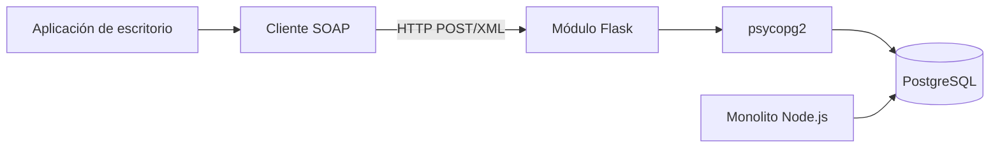

**Materia:** Integración de Aplicaciones Computacionales

**Nombre:** Santiago López Cervantes

**Matrícula:** 612956

**Grupo y hora:** MyV, 4:00 p.m.

**Fecha:** 2026-09-07

## Introducción

Este ejercicio incorpora un módulo SOAP independiente a la aplicación monolítica de librería desarrollada previamente. El nuevo componente se implementa en Flask y Python, publica un contrato WSDL con tipos XSD, construye manualmente los sobres XML y accede de forma controlada a PostgreSQL mediante `psycopg2`. La integración debe conservar el monolito sin modificaciones y permitir que aplicaciones de escritorio consulten y registren clasificaciones Cloud.

## Objetivo

Diseñar, construir, probar y documentar un módulo SOAP interoperable que consulte conceptos del catálogo, registre clasificaciones IaaS, PaaS, SaaS y FaaS, y reporte el progreso de los clasificadores.

## Alcance y restricciones

El módulo incluye las operaciones `ObtenerConceptosPendientes`, `RegistrarClasificacion` y `ObtenerProgresoUsuario`, tablas propias para clasificadores y clientes, SOAP Fault para errores y clientes de escritorio SOAP. Comparte la base de datos con el monolito únicamente para este ejercicio, pero no modifica su código ni sus tablas. Quedan fuera REST, GraphQL, migración del monolito y frameworks que oculten la construcción manual del Envelope.

## Parte 1: Análisis e integración

Se revisan `books`, `concepts`, `book_concepts` y `categories` para definir qué datos son de lectura y cuáles genera el módulo. El flujo de integración es:

El módulo debe organizarse en `soap/` para servicio, Envelope, Faults y seguridad; `wsdl/` para contrato; `sql/` para tablas propias; `db/` para acceso; y `tests/` para pruebas. Las credenciales se almacenan en variables de entorno y el usuario de PostgreSQL aplica mínimo privilegio.

## Parte 2: Persistencia y contrato

Las tablas `clasificadores`, `clasificaciones_cloud` y `clientes_servidos` registran la identidad del cliente, las clasificaciones y el conteo de peticiones. Deben incluir PK, FK, `UNIQUE`, `CHECK` e índices justificables, incluyendo una restricción que impida clasificar dos veces el mismo concepto por el mismo usuario.

El WSDL define mensajes de entrada y salida, tipos XSD, `portType`, `binding` y endpoint. El contrato expone únicamente ISBN, título, concepto, categoría y resultados necesarios; nunca credenciales, rutas internas ni columnas de auditoría innecesarias.

## Parte 3: SOAP manual y errores

`xml.etree.ElementTree` se utiliza para leer y construir el `Envelope`, distinguir `Header` y `Body`, manejar namespaces y escapar valores. Se validan campos obligatorios y modelos permitidos antes de ejecutar SQL. Conceptos inexistentes, XML inválido y modelos no permitidos producen Fault de cliente; una clasificación duplicada produce conflicto 409; una falla de PostgreSQL produce Fault de servidor y se registra el detalle únicamente en logs.

## Parte 4: Cliente y pruebas

Las aplicaciones de escritorio construyen solicitudes SOAP, las envían al endpoint, procesan respuestas y muestran mensajes comprensibles. No se conectan directamente a PostgreSQL. Las pruebas deben cubrir conceptos pendientes, registro de los cuatro modelos, progreso, duplicados, concepto inexistente, modelo inválido, XML inválido, persistencia y conteo de clientes.

## Evidencias

Agrega el WSDL/XSD, script SQL, diagrama, solicitudes y respuestas XML, SOAP Fault, capturas del cliente de escritorio, consultas de PostgreSQL, pruebas positivas y negativas, y documentación de decisiones. No publiques contraseñas, tokens, `.env` ni cadenas de conexión.

## Conclusión

El módulo SOAP demuestra cómo integrar una aplicación nueva con un monolito sin modificarlo, utilizando un contrato explícito y mensajes XML interoperables. La separación entre cliente, servicio, persistencia y contrato facilita las pruebas y limita la exposición de datos. El costo principal es la complejidad y el tamaño del mensaje XML, pero puede justificarse en escenarios donde el contrato formal, los Faults y la interoperabilidad sean prioridades.

## Referencias consultadas

1. W3C. *SOAP Version 1.2 Part 1: Messaging Framework*. https://www.w3.org/TR/soap12-part1/
2. W3C. *Web Services Description Language (WSDL) 1.1*. https://www.w3.org/TR/2001/NOTE-wsdl-20010315
3. Python Software Foundation. *xml.etree.ElementTree*. https://docs.python.org/3/library/xml.etree.elementtree.html
4. Flask Documentation. https://flask.palletsprojects.com/
5. PostgreSQL Global Development Group. *PostgreSQL Documentation*. https://www.postgresql.org/docs/