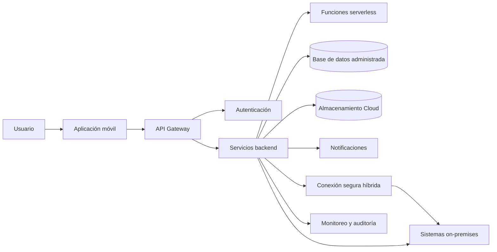

**Materia:** Integración de Aplicaciones Computacionales

**Nombre:** Santiago López Cervantes

**Matrícula:** 612956

**Grupo y hora:** MyV, 4:00 p.m.

**Fecha:** 2026-08-08

## Introducción

El diseño de una arquitectura para banca móvil requiere equilibrar disponibilidad, escalabilidad, seguridad, integración y cumplimiento. Las herramientas de IA generativa pueden ayudar a proponer componentes y alternativas, pero sus resultados deben revisarse y validarse con criterios de ingeniería. En esta tarea se diseña una arquitectura híbrida para una institución financiera y se documenta cómo evoluciona mediante prompts enfocados en seguridad, costos, observabilidad, resiliencia y calidad del código.

## Objetivo

Utilizar un IDE con capacidades de IA generativa o agentes de programación para diseñar, analizar y prototipar una arquitectura Cloud híbrida, evaluando críticamente la solución propuesta.

## Escenario

La solución corresponde a una aplicación de banca móvil con aplicación cliente, API Gateway, autenticación, servicios backend, bases de datos, almacenamiento, notificaciones, funciones serverless, monitoreo e integración con sistemas on-premises.

## Arquitectura propuesta

Los componentes Cloud se encargan de atender la demanda variable, ejecutar servicios y funciones, almacenar información cifrada y proporcionar monitoreo. Los sistemas on-premises pueden conservar información o procesos que requieran integración con la infraestructura existente, controles específicos o restricciones institucionales. La comunicación entre ambos entornos debe utilizar canales autenticados, cifrados y restringidos por políticas de red.

## Prompt inicial

> Actúa como arquitecto de soluciones Cloud. Diseña una arquitectura para una aplicación de banca móvil utilizando una estrategia de nube híbrida. Incluye aplicación móvil, API Gateway, servicios backend, autenticación, bases de datos, almacenamiento, funciones serverless/FaaS, monitoreo y mecanismos de seguridad. Identifica qué componentes deben permanecer on-premises y cuáles deben ejecutarse en la nube, justificando cada decisión. Propón una arquitectura escalable, tolerante a fallos y altamente disponible. Genera un diagrama de arquitectura y un prototipo básico del backend.

## Iteraciones de Prompt Engineering

| Iteración | Enfoque de revisión | Mejora esperada |
| :--- | :--- | :--- |
| 1 | Identificar vulnerabilidades | Autenticación fuerte, autorización, cifrado y protección de secretos |
| 2 | Reducir puntos únicos de falla | Redundancia, zonas de disponibilidad y recuperación ante fallos |
| 3 | Mejorar escalabilidad | Autoescalado, colas, caché y funciones orientadas a eventos |
| 4 | Justificar servicios y costos | Comparación de alternativas y estimación de consumo |
| 5 | Incorporar observabilidad y recuperación | Logs, métricas, alertas, respaldos y plan de recuperación ante desastres |

## Código y validación

Agrega aquí el prototipo de backend, la explicación de sus componentes, las pruebas realizadas y las modificaciones necesarias para un entorno de producción. La validación debe revisar seguridad, manejo de errores, configuración, pruebas automatizadas y separación de secretos respecto del código fuente.

## Reflexión individual

La IA generativa resulta útil para explorar alternativas y acelerar la elaboración de prototipos, pero no sustituye el criterio del ingeniero. Cada propuesta debe contrastarse con documentación oficial, requisitos del sistema, riesgos de seguridad, costos y pruebas técnicas. Documenta aquí qué cambió después de cada prompt, qué omisiones detectaste y qué decisiones permanecen bajo responsabilidad humana.

## Conclusión

El diseño de una arquitectura Cloud híbrida para banca móvil exige combinar servicios administrados con controles estrictos de seguridad, resiliencia y gobernanza. El Prompt Engineering ayuda a orientar la revisión hacia aspectos concretos, pero la solución final solo es confiable cuando se comprenden sus componentes, se validan sus supuestos y se prueban sus riesgos. La IA puede apoyar la generación de alternativas y código inicial; la selección arquitectónica, la protección de los datos financieros y la autorización para operar en producción deben permanecer bajo responsabilidad del ingeniero.

## Evidencias

* Herramienta de IA utilizada y prompt inicial: pendiente de documentar.
* Prompts de mejora y cambios por iteración: pendiente de agregar.
* Diagrama inicial y final: pendiente de agregar.
* Código generado y mejorado: pendiente de agregar.
* Screenshots, pruebas y errores encontrados: pendiente de agregar.

## Referencias consultadas

1. National Institute of Standards and Technology. *The NIST Definition of Cloud Computing*. https://doi.org/10.6028/NIST.SP.800-145
2. National Institute of Standards and Technology. *Cybersecurity Framework (CSF) 2.0*. https://www.nist.gov/cyberframework
3. OWASP Foundation. *OWASP Application Security Verification Standard*. https://owasp.org/www-project-application-security-verification-standard/
4. Cloud Native Computing Foundation. *Cloud Native Definition*. https://github.com/cncf/toc/blob/main/DEFINITION.md
5. Amazon Web Services. *AWS Well-Architected Framework*. https://docs.aws.amazon.com/wellarchitected/latest/framework/welcome.html